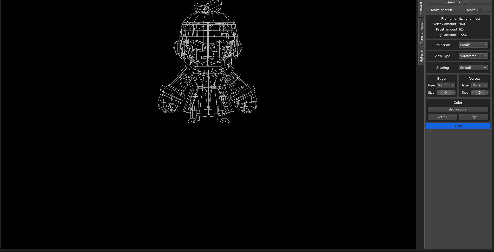
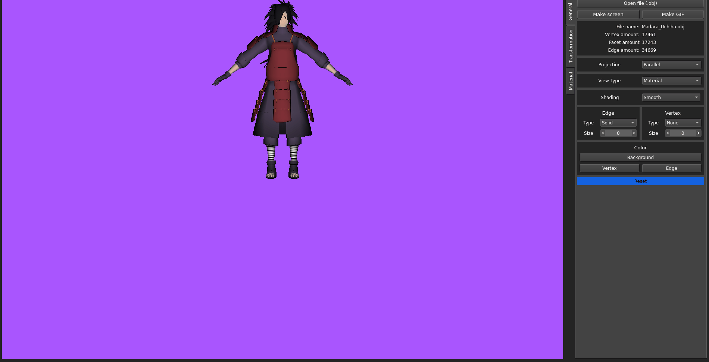

# ObjViewer_v2.0
New version of ObjViewer which fully written in C++(first version is in private and made mostly on C). 
## Features
- Full obj/mtl file support
- View type(wireframe, Solid and Material)

- Screenshot and GIF record
- Information about model(vertex amount, facet amout and etc)
- Projection(parallel and central)

- Shading(smooth and flat)

- Edge and vertex settings for wireframe view type
- Settings of last session are gonna be saved
- Transformations(move, rotate, scale), gif is a bit laggy

- Material properties + you can replace texture

- A lot more small features, you should check it out