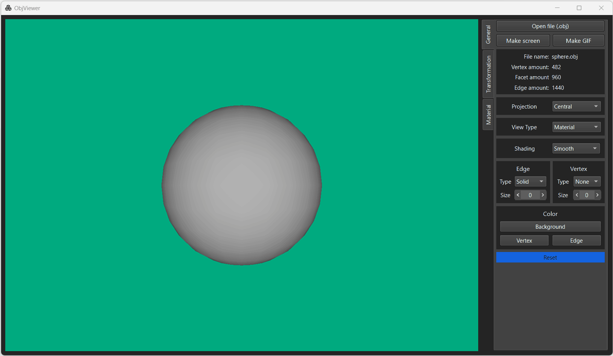
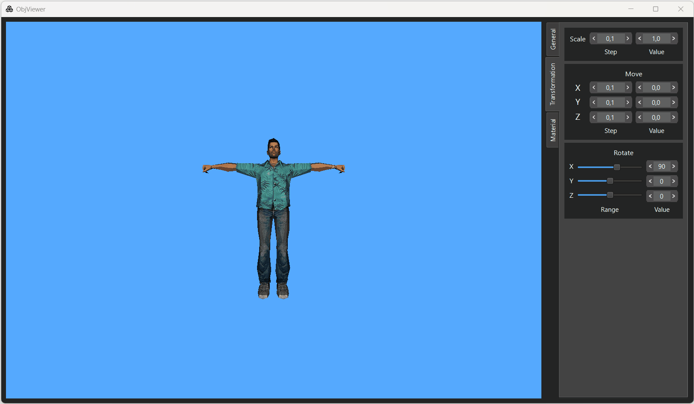
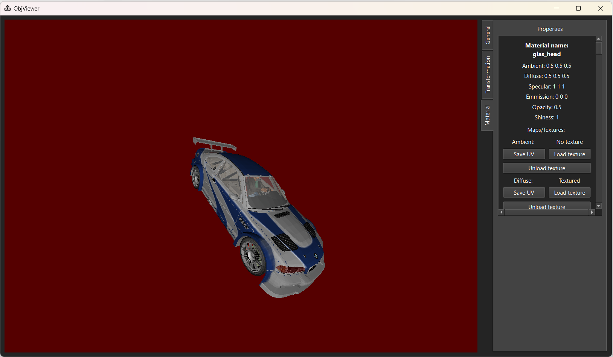

# ObjViewer_v2.0
New version of ObjViewer which fully written in C++(first version is in private and made mostly on C).
Ui is based on Qt, graphics are implemented using OpenGL and shaders(GLSL)
Support OS(Linux, Mac), Qt(5/6)
## Features
- Full obj/mtl file support
- View type(wireframe, Solid and Material)

- Screenshot and GIF record
- Information about model(vertex amount, facet amout and etc)
- Projection(parallel and central)

- Shading(smooth and flat)

- Edge and vertex settings for wireframe view type
- Settings of last session are gonna be saved
- Transformations(move, rotate, scale)

- Material properties. You can replace/unload texture + UV map export

- Non triangular faces are triangulated using earcut algorithm, plus more optimization algorithm are implemented
- A lot more small features, you should check it out